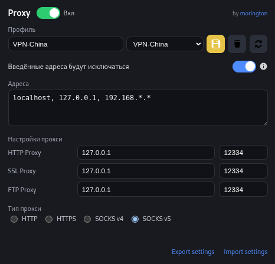
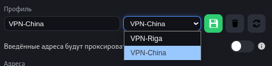
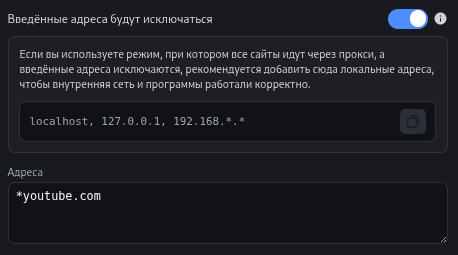
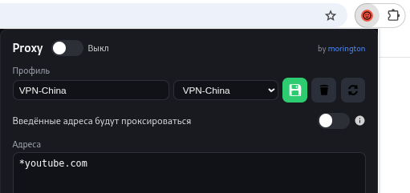
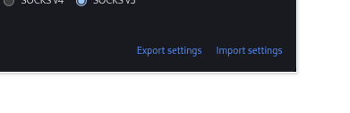
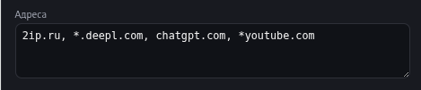

# **Select Proxy** 

### Расширение для удобного и контролируемого управления прокси‑настройками в браузере Google Chrome

#### Select Proxy создано как ответ на ограничения существующих расширений: недостаточный функционал, слабый контроль над трафиком и неудобные интерфейсы.

> В теории данное расширение может работать и с другими браузерами, но я их не использую, поэтому не тестировал.

---

## **1. Профили**

Расширение поддерживает несколько профилей. Каждый профиль включает:

- список доменов или IP;
- режим работы (проксировать только их или исключать);
- настройки HTTP/SSL/FTP прокси;
- выбранный тип: **SOCKS4 / SOCKS5 / HTTP / HTTPS**.

Профили можно создавать, переименовывать, удалять и быстро переключать.

---

## **2. Режим адресов**

Доступно два формата работы:

- проксируются **только указанные** адреса;
- проксируются **все**, кроме указанных.

Переключение — одной кнопкой.

---

## **3. Управление состоянием прокси**

Верхний тумблер включает/выключает прокси.  
Цвет иконки в панели браузера меняется:

- **зелёный** — прокси активен;  
- **красный** — выключен;  
- **белый** — профиль не выбран.

---

## **4. Локальная PAC‑логика**

PAC‑скрипт генерируется локально, в зависимости от режима:

- проксировать только перечисленные адреса;
- исключать перечисленные, направляя остальной трафик через прокси.

---

## **5. Импорт и экспорт**

Настройки можно сохранить в **JSON** и восстановить на другом устройстве.

---

## **6. Работа со списком адресов**

Поддерживаются форматы:

- `example.com`  
- `https://example.com/path`  
- `http://example.com`

Домен извлекается автоматически.  
Присутствует подсказка с советами по локальным адресам.

---

## **Почему Select Proxy**

- приятный минималистичный интерфейс;  
- простые переключатели;  
- предсказуемая логика PAC;  
- точный контроль, что уходит через прокси;  
- гибкая система профилей;  
- отсутствие визуального шума.

---

## **Установка**

1. Клонировать репозиторий  
2. Открыть `chrome://extensions/`  
3. Включить режим разработчика  
4. Нажать **«Загрузить расширение»**  
5. Указать папку проекта  

