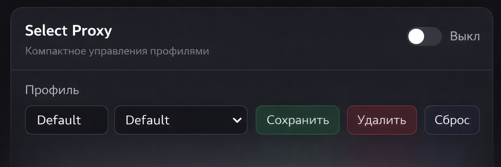
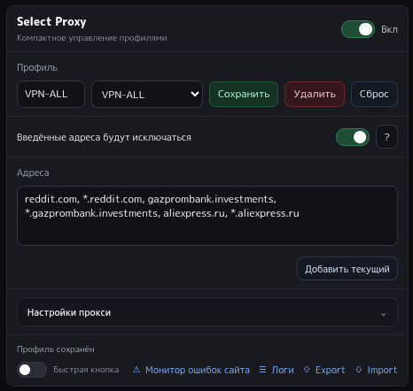
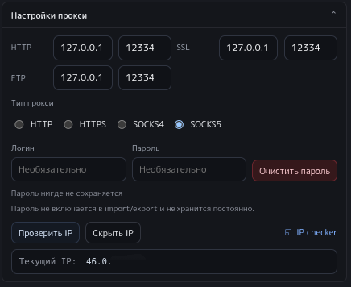
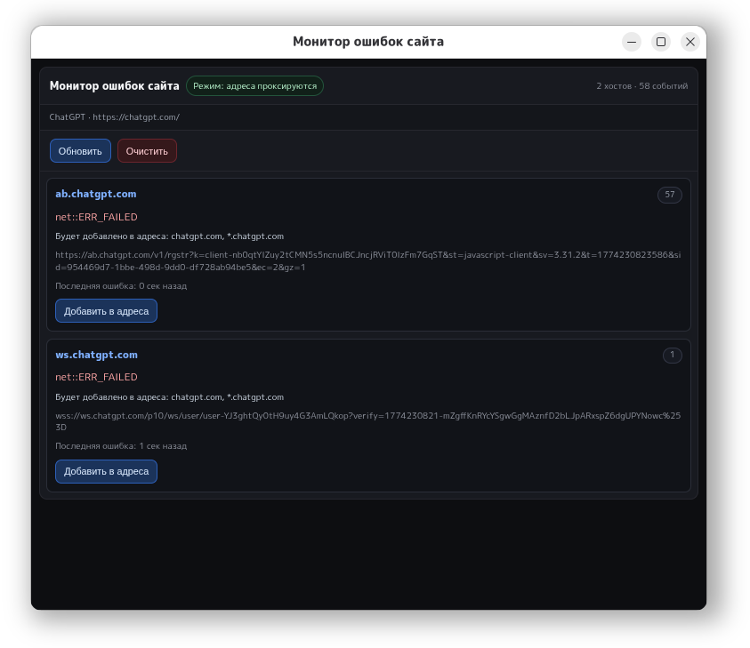
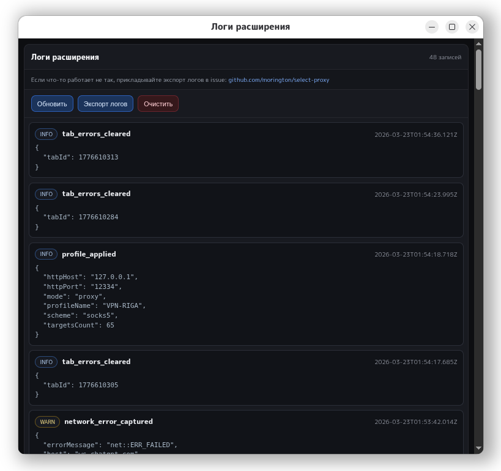

<div align="center">

# Select Proxy


### Удобное расширение для Google Chrome, которое помогает направлять нужные сайты через прокси — без лишней путаницы и без перегруженного интерфейса.



</div>

---

## 📌 Что это вообще такое

**Select Proxy** — это расширение для Chrome, которое позволяет очень просто управлять тем, какие сайты должны открываться через прокси, а какие напрямую.

Подходит для обычных повседневных задач:

- открыть только нужные сайты через прокси;
- пустить весь трафик через прокси, кроме исключений;
- быстро проверить, какой именно хост не подключается;
- временно принудительно проксировать текущую вкладку;
- сохранить несколько профилей под разные сценарии.

То есть это не «ещё один VPN». Это удобный инструмент управления маршрутом трафика в браузере.

---

## 📌 Что умеет расширение

- создание нескольких профилей;
- добавление списка адресов для разных правил;
- два режима работы:
  - **через прокси только адреса из списка**;
  - **через прокси всё, кроме адресов из списка**;
- поддержка **HTTP / HTTPS / SOCKS4 / SOCKS5**;
- быстрая кнопка проксирования для текущей вкладки;
- монитор ошибок сайта с быстрым добавлением/удалением адреса;
- экспорт и импорт настроек.

---

## 📌 Как работает логика адресов

В расширении есть поле **«Адреса»**.



Туда указываются хосты и домены, например:

```text
truthsocial.com, *.truthsocial.com, example.org, api.example.org
```

Дальше всё зависит от выбранного режима.

### 1. Введённые адреса будут проксироваться

В этом режиме через прокси пойдут **только** адреса из поля.

Всё остальное будет открываться напрямую.

Это удобно, когда прокси нужен только для отдельных сайтов.

### 2. Введённые адреса будут исключаться

В этом режиме наоборот: **весь трафик** идёт через прокси, а адреса из поля открываются напрямую.

Это удобно, когда нужен почти полный прокси-режим, но некоторые сайты, локальные адреса или внутренние сервисы должны работать без него.

---

## 📌 Профили

Расширение поддерживает несколько профилей.

Это удобно, если у тебя разные варианты использования, например:

- один профиль для пары нужных сайтов;
- другой - для почти полного проксирования;
- третий - для отдельного рабочего сценария.

У каждого профиля свои:

- адреса;
- режим;
- настройки прокси;
- логин для авторизации.

Профили можно быстро переключать, сохранять, удалять и восстанавливать.

---

## 📌 Быстрая кнопка

Внизу слева на каждом сайте может появляться **маленькая плавающая иконка**.

Она нужна для быстрого принудительного проксирования **текущей вкладки**.

То есть если нажать эту кнопку:

- текущая вкладка начнёт идти через прокси;
- это будет работать **вне зависимости от основного списка адресов**;
- правило сохраняется именно для этой вкладки;
- даже если сайт делает **редиректы**, вкладка всё равно останется в режиме проксирования.

Это очень удобно, когда нужно быстро проверить сайт или открыть одну конкретную страницу через прокси, не трогая основной профиль.

---

## 📌 Настройки прокси



Блок **«Настройки прокси»** раскрывается отдельно, чтобы не мешать в обычной работе.

Внутри можно указать:

- HTTP proxy;
- SSL proxy;
- FTP proxy;
- тип прокси:
  - HTTP
  - HTTPS
  - SOCKS4
  - SOCKS5
- логин;
- пароль.

### Важно про пароль

Пароль не участвует в export/import и не хранится как постоянная часть экспортируемых настроек.

После импорта его нужно ввести заново.

### Проверка IP

В этом же блоке есть кнопка проверки IP.

Она помогает быстро посмотреть, через какой IP сейчас идёт запрос. Это удобно для быстрой проверки, действительно ли прокси включился и применяется так, как ожидается.

---

## 📌 Монитор ошибок сайта



Это одна из самых удобных функций расширения.

Если сайт открывается криво, не догружает API, ломает часть интерфейса или что-то просто «не работает как надо», обычно приходится открывать инструменты разработчика и смотреть вкладку **Network**.

Но далеко не всем хочется туда лезть.

Именно для этого в расширении есть **Монитор ошибок сайта**.

Он показывает:

- какой хост не подключился;
- какая ошибка произошла;
- сколько раз она повторилась;
- есть ли этот хост уже в адресах;
- можно ли его быстро добавить или убрать.

### Почему это удобно

Сайт не всегда работает именно в своем домене. У него есть разные поддомены, а также дополнительные адреса куда он может обращаться. А значит нам надо 
как-то найти их и добавить в проксирование, иначе он будет работать некорректно. Или наоборот убрать из маршрута прокси.

Достаточно:

1. открыть сайт;
2. открыть **Монитор ошибок сайта**;
3. посмотреть, какой хост не подключается;
4. добавить его в адреса или удалить из правил, если он уже там есть;
5. обновить страницу.

По сути это быстрый и понятный способ найти недостающие хосты, не копаясь в DevTools.

---

## 📌 Логи расширения



В расширении есть отдельное окно логов.

Там можно посмотреть основные события:

- применение профиля;
- включение и выключение прокси;
- ошибки сети;
- действия монитора ошибок;
- внутренние события расширения.

Логи можно экспортировать в файл.

Если что-то работает не так, лог-файл удобно приложить в issue:

**https://github.com/morington/select-proxy**

---

## 📌 Экспорт и импорт настроек

Настройки можно сохранить в JSON и потом загрузить обратно.

Это удобно, если нужно:

- перенести конфигурацию на другой компьютер;
- сохранить резервную копию;
- быстро восстановить рабочую схему.

### 📌 Что не попадает в экспорт

- пароль прокси;
- логи расширения.

---

## 📌 Установка из GitHub Release

### Шаг 1. Открой страницу релизов

Перейди в репозиторий проекта на GitHub и открой раздел **Releases**.

Там лежат готовые версии расширения.

### Шаг 2. Скачай последний релиз

Скачай архив с последней версией на компьютер.

Обычно это `.zip`.

### Шаг 3. Распакуй архив

Очень важно: Chrome не загружает расширение прямо из zip-архива.

Нужно:

- распаковать архив;
- получить обычную папку с файлами расширения;
- положи папку удобное место.

Внутри этой папки должен лежать файл:

```text
manifest.json
```

Если `manifest.json` лежит глубже во вложенной папке, нужно выбрать именно ту папку, где он находится.

### Шаг 4. Открой страницу расширений Chrome

В адресной строке Chrome открой:

```text
chrome://extensions/
```

### Шаг 5. Включи режим разработчика

Справа сверху включи переключатель **«Режим разработчика»**.

### Шаг 6. Нажми «Загрузить распакованное расширение»

После включения режима разработчика появится кнопка:

**«Загрузить распакованное расширение»**

Нажми её.

### Шаг 7. Выбери папку с расширением

Выбери папку, которую ты распаковал из релиза.

Нужно выбрать **папку целиком**, а не отдельный файл.

### Шаг 8. Готово

После этого расширение появится в списке установленных расширений Chrome.

При желании можно закрепить его на панели браузера.

---

## 📌 Если Chrome не даёт загрузить расширение

Проверь по списку:

- выбрана именно папка, а не zip-файл;
- внутри папки действительно есть `manifest.json`;
- расширение не лежит во вложенной папке вида `project-main/project-main/`;
- включён **Режим разработчика**;
- архив распакован полностью.

---

## 📌 Рекомендация по прокси-клиенту на ПК

Если нужен удобный клиент на компьютере, который можно использовать вместе с этим расширением, стоит посмотреть в сторону **Hiddify**.

Это кроссплатформенный клиент с поддержкой разных протоколов, открытым исходным кодом и готовыми сборками для нескольких платформ. У проекта есть официальный сайт и GitHub-репозиторий. Я сам **не продаю VPN** и не предлагаю какие-то платные подписки — это просто рекомендация удобного инструмента, если нужен клиент на ПК.

---

## 📌 Быстрый сценарий использования

Если коротко, обычно работа выглядит так:

1. установить расширение;
2. создать профиль;
3. указать адрес и порт прокси;
4. при необходимости ввести логин и пароль;
5. добавить адреса в поле **«Адреса»**;
6. выбрать режим;
7. включить прокси;
8. если сайт работает не полностью — открыть **Монитор ошибок сайта** и посмотреть, какой хост не подключается.

---

## 📌 Обратная связь

Если найдёшь баг, захочешь предложить улучшение или просто приложить логи:

**https://github.com/morington/select-proxy/issues**

Лучше всего приложить:

- краткое описание проблемы;
- что именно делалось;
- экспорт логов, если проблема воспроизводится.

---

**Select Proxy** — это удобный способ управлять прокси в Chrome без лишней возни.

Когда нужно быстро понять, почему сайт не открывается, временно принудительно пустить текущую вкладку через прокси, аккуратно собрать адреса и не запутаться 
в настройках — расширение как раз для 2026 года :)
